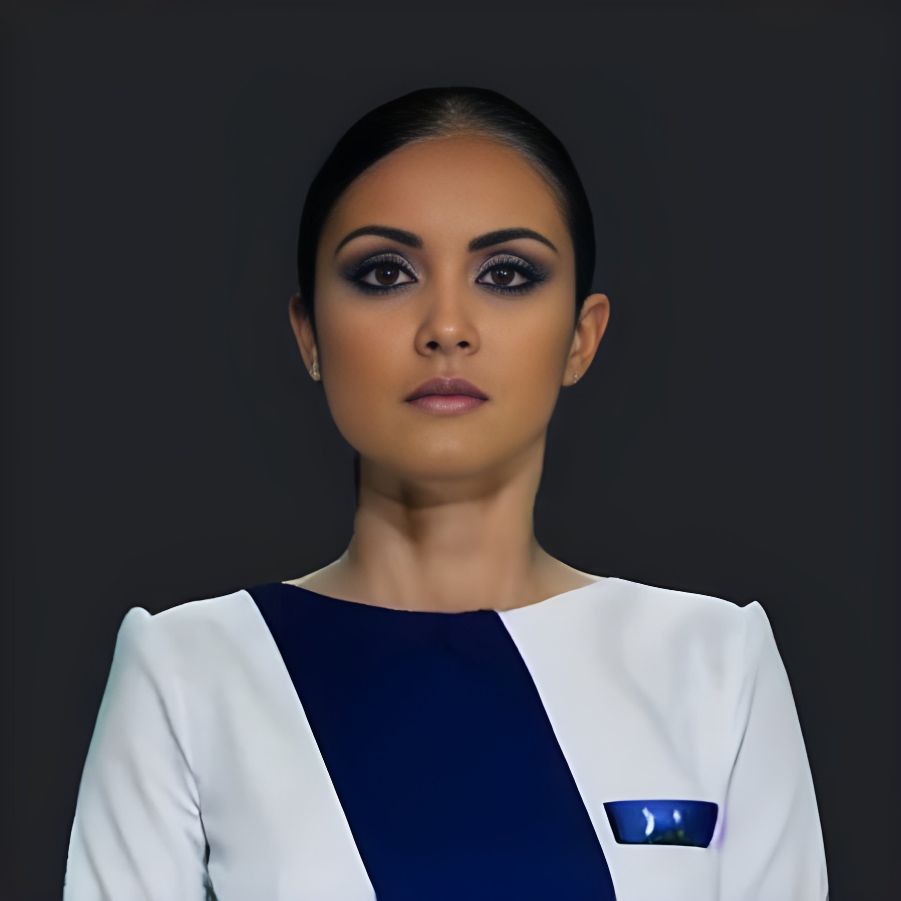
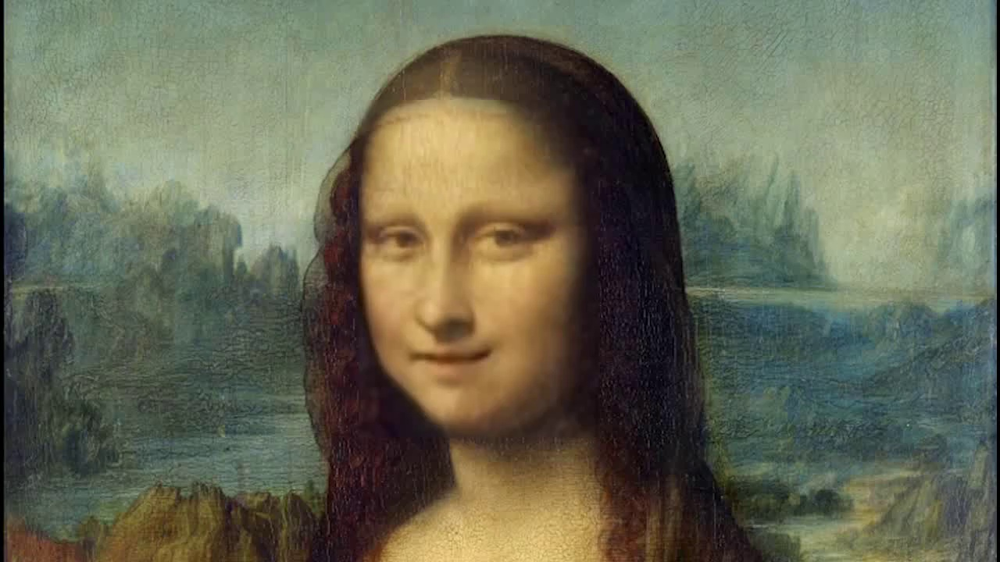
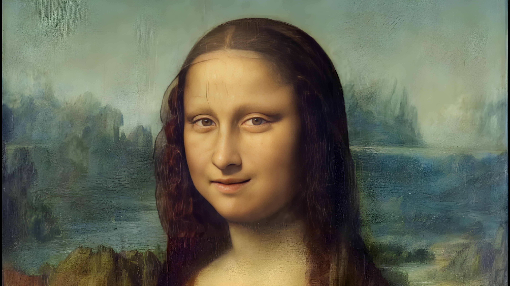

# Wav2Lip-HD: Improving Wav2Lip to achieve High-Fidelity Videos

This repository contains code for achieving high-fidelity lip-syncing in videos, using the [Wav2Lip algorithm](https://github.com/Rudrabha/Wav2Lip) for lip-syncing and the [Real-ESRGAN algorithm](https://github.com/xinntao/Real-ESRGAN) for super-resolution. The combination of these two algorithms allows for the creation of lip-synced videos that are both highly accurate and visually stunning.

## Algorithm

The algorithm for achieving high-fidelity lip-syncing with Wav2Lip and Real-ESRGAN can be summarized as follows:

1. The input video and audio are given to `Wav2Lip` algorithm.
2. Python script is written to extract frames from the video generated by wav2lip.
3. Frames are provided to Real-ESRGAN algorithm to improve quality.
4. Then, the high-quality frames are converted to video using ffmpeg, along with the original audio.
5. The result is a high-quality lip-syncing video.
6. The specific steps for running this algorithm are described in the [Testing Model](https://github.com/saifhassan/Wav2Lip-HD#testing-model) section of this README.

## Testing Model

To test the "Wav2Lip-HD" model, follow these steps:

1. Clone this repository and install requirements using following command (Make sure, Python and CUDA are already installed):

    ```
    git clone https://github.com/saifhassan/Wav2Lip-HD.git
    cd Wav2Lip-HD
    pip install -r requirements.txt
    ```
    
2. Downloading weights

| Model        | Directory           | Download Link  |
| :------------- |:-------------| :-----:|
| Wav2Lip           | [checkpoints/](https://github.com/saifhassan/Wav2Lip-HD/tree/main/checkpoints)   | [Link](https://drive.google.com/drive/folders/1tB_uz-TYMePRMZzrDMdShWUZZ0JK3SIZ?usp=sharing) |
| ESRGAN            | [experiments/001_ESRGAN_x4_f64b23_custom16k_500k_B16G1_wandb/models/](https://github.com/saifhassan/Wav2Lip-HD/tree/main/experiments/001_ESRGAN_x4_f64b23_custom16k_500k_B16G1_wandb/models) | [Link](https://drive.google.com/file/d/1Al8lEpnx2K-kDX7zL2DBcAuDnSKXACPb/view?usp=sharing) |
| Face_Detection    | [face_detection/detection/sfd/](https://github.com/saifhassan/Wav2Lip-HD/tree/main/face_detection/detection/sfd) | [Link](https://drive.google.com/file/d/1uNLYCPFFmO-og3WSHyFytJQLLYOwH5uY/view?usp=sharing) |
| Real-ESRGAN       | Real-ESRGAN/gfpgan/weights/   | [Link](https://drive.google.com/drive/folders/1BLx6aMpHgFt41fJ27_cRmT8bt53kVAYG?usp=sharing) |
| Real-ESRGAN       | Real-ESRGAN/weights/          | [Link](https://drive.google.com/file/d/1qNIf8cJl_dQo3ivelPJVWFkApyEAGnLi/view?usp=sharing) |


3. Put input video to `input_videos` directory and input audio to `input_audios` directory.
4. Open `run_final.sh` file and modify following parameters:
 
     `filename=kennedy` (just video file name without extension)
     
     `input_audio=input_audios/ai.wav` (audio filename with extension)

5. Execute `run_final.sh` using following command:

    ```
    bash run_final.sh
    ```
    
6. Outputs

- `output_videos_wav2lip` directory contains video output generated by wav2lip algorithm.
- `frames_wav2lip` directory contains frames extracted from video (generated by wav2lip algorithm).
- `frames_hd` directory contains frames after performing super-resolution using Real-ESRGAN algorithm.
- `output_videos_hd` directory contains final high quality video output generated by Wav2Lip-HD.


## Results
The results produced by Wav2Lip-HD are in two forms, one is frames and other is videos. Both are shared below:

### Example output frames </summary>
<table>
  <tr>
    <td>Frame by Wav2Lip</td>
     <td>Optimized Frame</td>
  </tr>
  <tr>
    <td></td>
    <td></td>
  </tr>
    <tr>
    <td></td>
    <td></td>
  </tr>

  </tr>
    <tr>
    <td></td>
    <td></td>
  </tr>
 </table>
 </Details>

 ### Example output videos
    
 | Video by Wav2Lip  | Optimized Video |
| ------------- | ------------- |
| <video src="https://user-images.githubusercontent.com/11873763/229389410-56d96244-8c67-4add-a43e-a4900aa9db88.mp4" width="500">  | <video src="https://user-images.githubusercontent.com/11873763/229389414-d5cb6d33-7772-47a7-b829-9e3d5c3945a1.mp4" width="500">|
| <video src="https://user-images.githubusercontent.com/11873763/229389751-507669f1-7772-4863-ab23-8df7f206a065.mp4" width="500">  | <video src="https://user-images.githubusercontent.com/11873763/229389962-5373b765-ce3a-4af2-bd6a-8be8543ee933.mp4" width="500">|

## Acknowledgements

We would like to thank the following repositories and libraries for their contributions to our work:

1. The [Wav2Lip](https://github.com/Rudrabha/Wav2Lip) repository, which is the core model of our algorithm that performs lip-sync.
2. The [face-parsing.PyTorch](https://github.com/zllrunning/face-parsing.PyTorch) repository, which provides us with a model for face segmentation.
3. The [Real-ESRGAN](https://github.com/xinntao/Real-ESRGAN) repository, which provides the super resolution component for our algorithm.
4. [ffmpeg](https://ffmpeg.org), which we use for converting frames to video.


    


